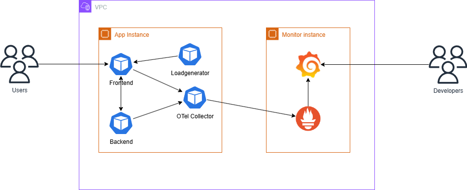

# Calanda

This project provisions two virtual machines in a cloud environment and deploys a simple application on one of them to measure and expose the network latency to the second machine.

## Technologies

- Terraform → Chosen for infrastructure provisioning due to wide adoption and strong AWS support.

- AWS EC2 → Preferred cloud provider, but code can be adapted for others.

- Docker + Python (Flask) + Java (Springboot) → Simple and portable way to run the latency app.

- Open Telemetry: Provides vendor-neutral observability (metrics, logs, traces) and makes it easy to instrument the application for distributed tracing.

- Prometheus: Metrics collection system used to scrape and store latency data from the applications /metrics endpoint.

- Shell scripts → Lightweight automation without requiring extra configuration management tools.

## Architecture



1. User access to application
2. Otel Collector collect customized metrics defined in code
3. Prometheus scrapes metrics from OTel Collector
4. Grafana visualize metrics

## Metrics

| OTel Instrument Name              | Prometheus Metric Name(s)                                                                 | Description                                                                 |
|-----------------------------------|-------------------------------------------------------------------------------------------|-----------------------------------------------------------------------------|
| `index_counter`                   | `index_called_request_total`                                                              | Counter – number of times the **index** API is called                       |
| `add_counter`                     | `add_called_request_total`                                                                | Counter – number of times the **add** API is called                         |
| `delete_counter`                  | `delete_called_request_total`                                                             | Counter – number of times the **delete** API is called                      |
| `error_rate`                      | `error_rate_request_total`                                                                | Counter – number of requests that returned errors                           |
| `http.server.request.duration`    | `http_server_request_duration_seconds_bucket`, `http_server_request_duration_seconds_sum`, `http_server_request_duration_seconds_count` | Histogram – measures HTTP request latency (bucket: latency distribution, sum: total time, count: total number of requests) |

- Notes: When Otel collector send metrics to Prometheus has some changes in name because of Metric and label naming rules of Prometheus

Reference: [Prometheus conventions](https://prometheus.io/docs/practices/naming)

## Guideline

### Manual deploy

```bash
export DOCKER_USERNAME=""
export DOCKER_PASSWORD=""

# login Docker Hub
docker login -u "$DOCKER_USERNAME" -p "$DOCKER_PASSWORD"

# build backend
docker build -t "$DOCKER_USERNAME/backend:v1" ./todobackend-springboot

# build frontend
docker build -t "$DOCKER_USERNAME/frontend:v1" ./todoui-flask

# build loadgenerator
docker build -t "$DOCKER_USERNAME/loadgenerator:v1" ./loadgenerator


docker push "$DOCKER_USERNAME/backend:v1"
docker push "$DOCKER_USERNAME/frontend:v1"
docker push "$DOCKER_USERNAME/loadgenerator:v1"

export TF_WORKING_DIR="./terraform"
export TF_VAR_DOCKER_USERNAME="$DOCKER_USERNAME"
export TF_VAR_DOCKER_PASSWORD="$DOCKER_PASSWORD"
terraform -chdir=${TF_WORKING_DIR} init
terraform -chdir=${TF_WORKING_DIR} apply -auto-approve
```

### Automate deploy by using Github action

1. Create secret variables

- DOCKER_USERNAME
- DOCKER_PASSWORD
- AWS_ACCESS_KEY_ID
- AWS_SECRET_ACCESS_KEY

2. Create S3 bucket and update in file **./terraform/versions.tf**

3. Go to Github Action and click **Run workflow**


- Notes: Sometimes it maybe have Error: remote-exec provisioner error. You can wait a short time and run workflow again

### Grafana dashboard

1. Access to http://{monitor_instance_public_ip}:3000
2. Dashboard -> Todo App - OTel Metrics

- Notes: After instance started, wait some minutes in order to Prometheus scrape metrics

## Assumptions, Limitations, and Tradeoffs

### Assumptions

- Application-level latency is sufficient to demonstrate the assignment requirements.
- Docker images are built and pushed to Docker Hub successfully before Terraform provisioning.

### Limitations

- Latency reflects application-perceived latency rather than pure network latency.
- Prometheus and Grafana run as single instances without high availability.
- The load generator produces basic traffic and does not simulate real-world usage patterns.

### Tradeoffs

- Chose OTel instrumentation inside the app instead of raw ping measurements to leverage the existing observability stack.
- Accepted that adding custom application metrics (counters, histograms, error tracking) can slightly increase overhead and latency when exporting to the OTel Collector. The tradeoff is better observability and more detailed insights at the cost of a small performance impact.

## Latency Insights

### Sources of latency

- Latency is measured at the application level through HTTP requests, so it reflects both network delay and processing time in the app (Flask, Spring Boot).

- Occasional spikes were observed when frontend, backend services were under load (e.g., garbage collection, warm-up), even though the underlying network remained stable

### Improving precision or consistency

- In a more advanced setup, separating raw network latency (e.g., ICMP/TCP probes) from application-level latency would provide clearer insights.
- Adjusting Prometheus scrape intervals and OTel sampling could improve resolution of short-lived latency fluctuations.

### Production considerations

- Would add synthetic probes (e.g., blackbox_exporter) to differentiate between application latency and raw network latency.
- Use distributed tracing (via OpenTelemetry) to attribute delays across backend, frontend, and DB layers.
- Introduce autoscaling policies for spikes in workload to prevent resource saturation.
